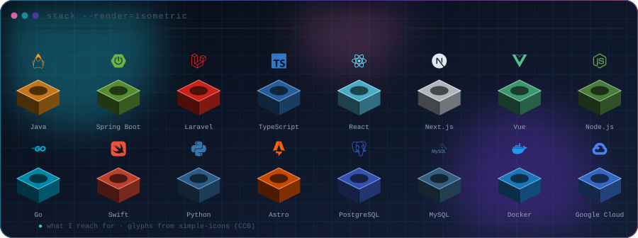
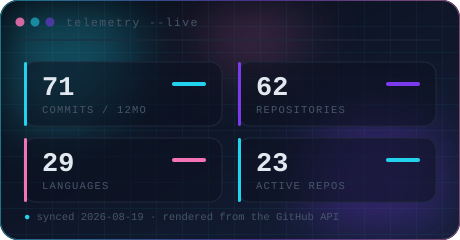

<div align="center">

<picture>
  <source media="(prefers-color-scheme: dark)" srcset="assets/hero-dark.svg" />
  <source media="(prefers-color-scheme: light)" srcset="assets/hero-light.svg" />
  
</picture>

<br />

[](https://sthlabs.net)
[](https://www.linkedin.com/in/stavros-thalassinos/)
[](https://stavros-thalassinos.netlify.app/)

</div>

---

## `> whoami`

```text
┌───────────────────────────────────────────────────────────────────────────┐
│  stavros thalassinos — senior software engineer · athens, gr · remote eu  │
├───────────────────────────────────────────────────────────────────────────┤
│  day job   payment infrastructure at OKTO Payments                        │
│  side      STH Labs — small, sharp products shipped end to end            │
│  depth     backend systems, APIs, data correctness, observability         │
│  breadth   full-stack delivery, cloud, CI/CD, native macOS, AI tooling    │
└───────────────────────────────────────────────────────────────────────────┘
```

I build and modernize production software for fintech and SaaS teams. Most of my work lives
where **money, state and retries meet** — the places where "mostly correct" is not correct:
idempotent webhooks, reconciliation, saga flows, and APIs that stay honest under load.

The rest of the time I ship products solo, from first commit to signed release.

## `> currently --building`

| project | what it is | stack |
|:--|:--|:--|
| **Akova** | On-device dictation for macOS — local Whisper inference, menu-bar native, no audio leaves the machine | `Swift` `SwiftUI` `CoreML` |
| **STH Labs** | The studio front for my product work — [sthlabs.net](https://sthlabs.net) | `Astro` `Tailwind` |
| **Payment rails** | LATAM pay-in flows, reconciliation and payout batching in production | `Java` `Spring Boot` `MySQL` |
| **Agent tooling** | CLIs, MCP servers and workflow automation that make my own dev loop faster | `TypeScript` `Go` `Python` |

## `> stack --core`

<div align="center">

<picture>
  <source media="(prefers-color-scheme: dark)" srcset="assets/stack3d-dark.svg" />
  <source media="(prefers-color-scheme: light)" srcset="assets/stack3d-light.svg" />
  
</picture>

</div>

```yaml
backend:      Java · Spring Boot · Laravel · Go · REST APIs · MySQL · PostgreSQL
frontend:     TypeScript · React · Next.js · Vue · Astro
native:       Swift · SwiftUI · React Native
platform:     Docker · Google Cloud · AWS · CI/CD · Grafana · CloudWatch
product:      Fintech · SaaS · AI integrations · Developer workflows
```

## `> telemetry --live`

<div align="center">

<picture>
  <source media="(prefers-color-scheme: dark)" srcset="assets/stats-dark.svg" />
  <source media="(prefers-color-scheme: light)" srcset="assets/stats-light.svg" />
  
</picture>
<picture>
  <source media="(prefers-color-scheme: dark)" srcset="assets/langs-dark.svg" />
  <source media="(prefers-color-scheme: light)" srcset="assets/langs-light.svg" />
  
</picture>

<picture>
  <source media="(prefers-color-scheme: dark)" srcset="assets/pulse-dark.svg" />
  <source media="(prefers-color-scheme: light)" srcset="assets/pulse-light.svg" />
  
</picture>

</div>

## `> ls selected-work`

| repository | what it demonstrates | stack |
|:--|:--|:--|
| [**hackathon-athens-2025**](https://github.com/stavthal/hackathon-athens-2025) | Award-winning hackathon build — rapid product delivery under a clock | `Team` |
| [**flexyword-backend**](https://github.com/stavthal/flexyword-backend) | Go REST service: modular architecture and persistence patterns | `Go` |
| [**flexybe-frontend**](https://github.com/stavthal/flexybe-frontend) | Vue front end for a business workflow platform | `Vue` |
| [**gecko-proxy**](https://github.com/stavthal/gecko-proxy) | Full-stack crypto dashboard with a backend proxy for the CoinGecko API | `React` `Node` |
| [**check4me-web**](https://github.com/stavthal/check4me-web) | Nuxt client for Check4Me | `Nuxt` |
| [**local-meeting-notes**](https://github.com/stavthal/local-meeting-notes) | Fully local meeting transcription and summarisation | `Python` |

## `> cat .github/`

The cards above are generated, not embedded — no third-party stats service, nothing to 404
when someone else's free tier runs out. `scripts/render.mjs` pulls live GitHub data, writes
eight SVGs into `assets/`, and a daily Action commits them only when the numbers move.

```bash
npm run render     # regenerate assets/ (needs GITHUB_TOKEN)
npm run preview    # render, then eyeball both themes locally
```

---

<div align="center">

`$ build useful things. ship them well. keep learning.`

</div>
